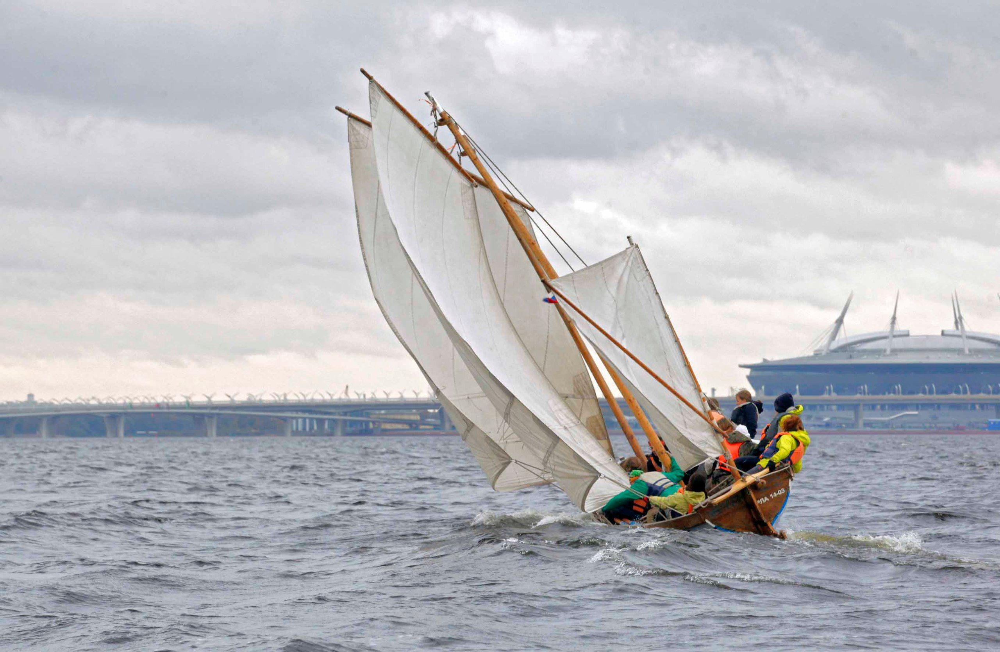
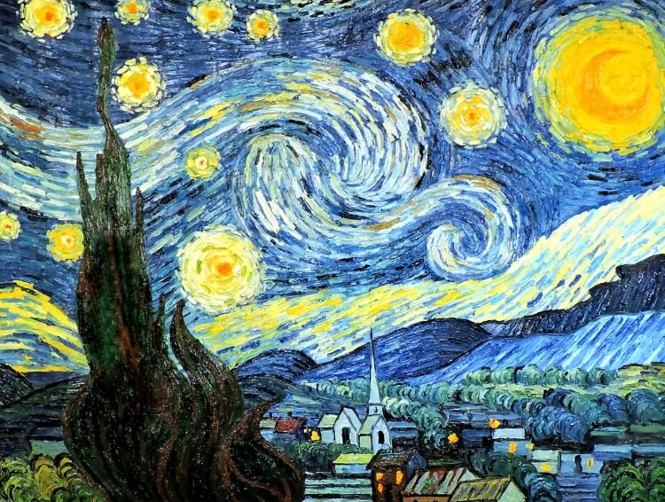
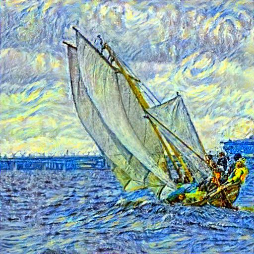

# Neural Transfer Style Telegram Bot

### Description:

*Нейронный перенос стиля* - это алгоритм, который принимает контент-изображение (например, черепаху), стиль-изображение (например, картинку известного художника) и возвращает изображение, которое будто бы нарисовано тем художником.

В этом боте используется алгоритм переноса стиля 
Леона А. Гатиса, Александра С. Эккера и Маттиаса Бетге.
[ссылка на статью Neural-Style](https://arxiv.org/abs/1508.06576)

Бот реализован на асинхронном фреймворке aiogram, в рамках итогового проекта в [Deep Learning School](https://www.dlschool.org) (осенний семестр 2021 базовый поток)

### Example
- **_Original_**

- **_Style_**  
_

- **_Result_**  
_

### Requirements

- Python 3.8
- PyTorch (+cpu for minimal hardware requirements)
- TorchVision (+cpu for minimal hardware requirements)
- Pillow
- aiogram

_minimal hardware:_
- 1Gb Ram
- 1 core cpu

### Features
- aiogram FSM
- default styles
- only conv layers from pretrained VGG19 (4Mb instead 550Mb)
- asynchronous work (not realized yet)
